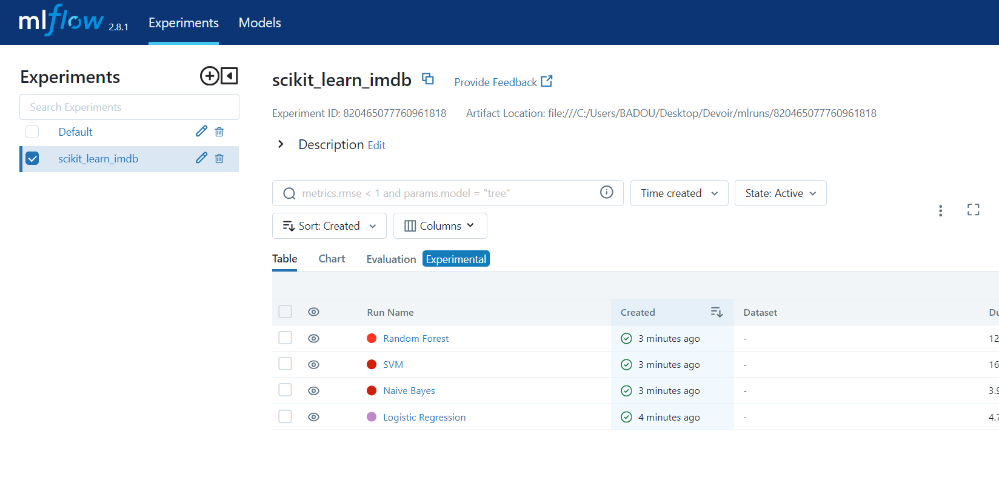
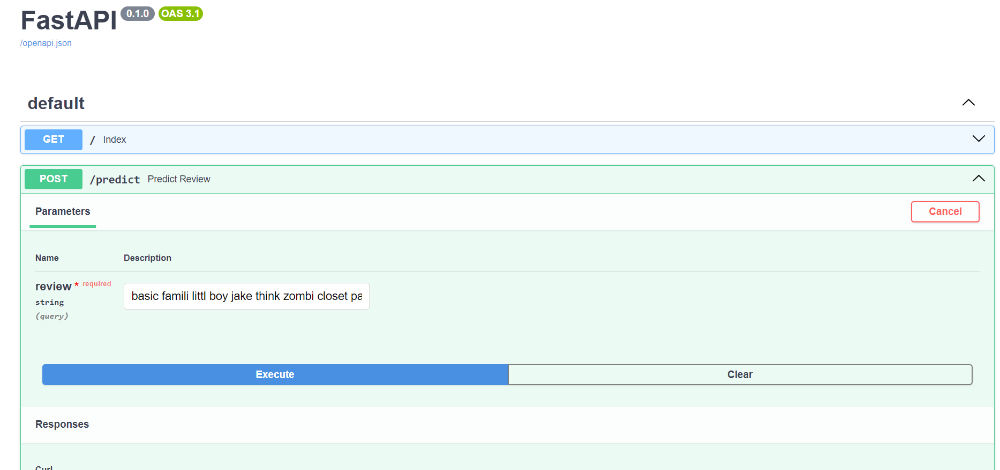
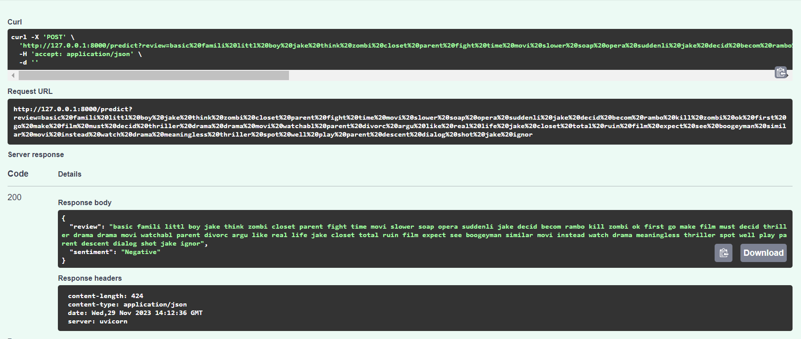
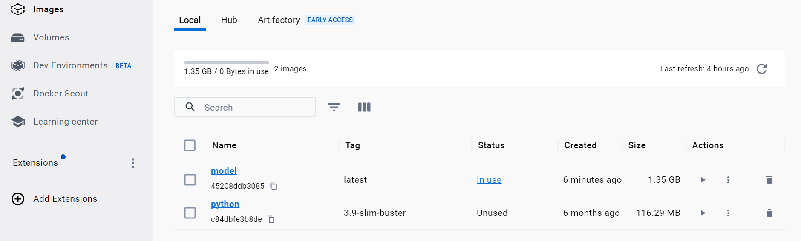
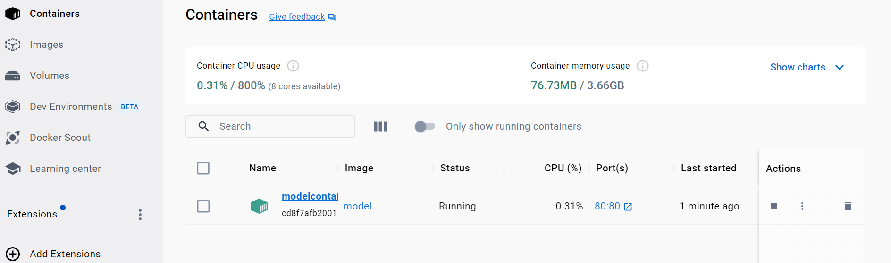
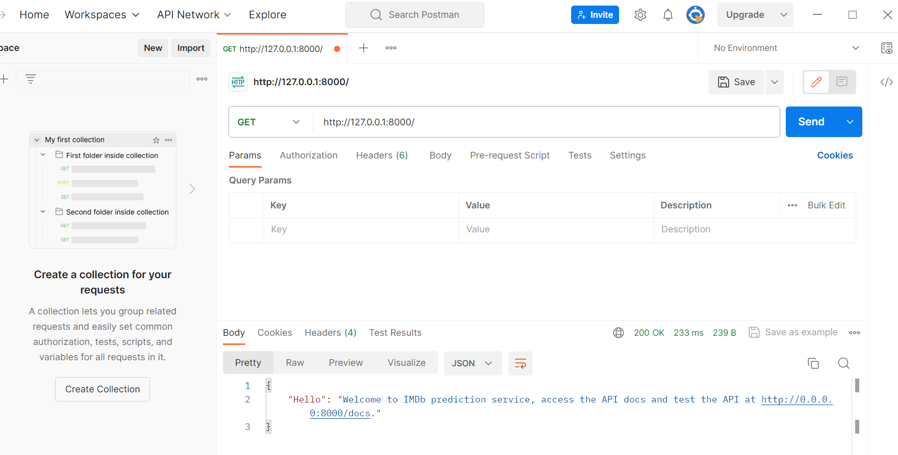
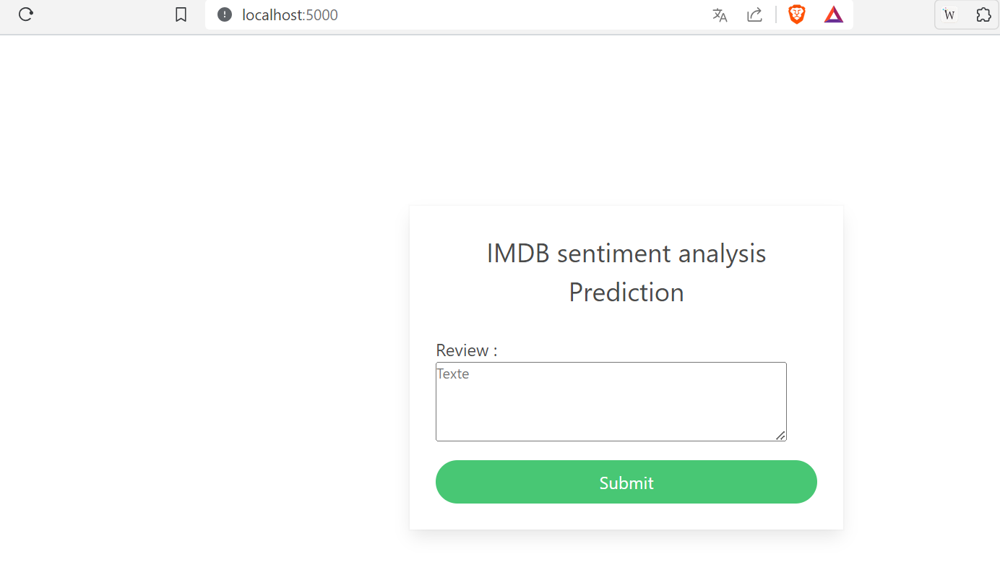
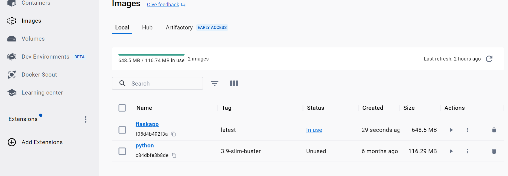
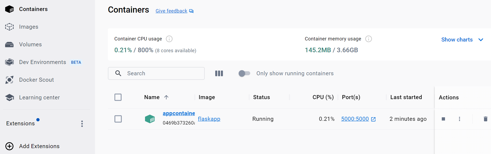

# imdb-dataset-of-50k-movie-reviews deployement

# Overview
Here we use the dataset of imdb-dataset-of-50k-movie-reviews for our different instructions:

  # Using Mlflow
  The result of the various instructions we have been given here, namely:start by preprocessing your data, train 5 ML models, try to track models performance, versions and       parameters
  and save your best model in ONNX format and its dedicated preprocessing transformations
  (i.e., using transformers API) in pickle format.

  Here is a screen of mlflow dashboard to illustrate it:
  
   

  # Using fastAPI
  Now after saving our best model, we create a REST API for your model :
  
  
  
  
  
  After this, we package your model as a container using Docker as a container runtime. The contents of our dockerfile :
  
      - FROM python:3.9-slim-buster 
      - WORKDIR /app
      - COPY . /app
      - RUN pip install -r requirements.txt
      - EXPOSE 80
      - CMD ["uvicorn", "main:app", "--host", "0.0.0.0", "--port", "80"]
      
    Here are screens of our model as a container:
  
    
  
    
  
  We consume your created APIs using Postman ! 

# Using Flask

We create a dedicated application to consume your API with the run of appflask.py and we obtain this:

After we create it we package your application as a container using Docker. The contents of our dockerfile :

      - FROM python:3.9-slim-buster 
      - WORKDIR /app
      - COPY . /app
      - RUN pip install -r requirements.txt
      - EXPOSE 5000
      - CMD ["python", "appflask.py"]

Here are screens of our application as a container:

  

 

 

